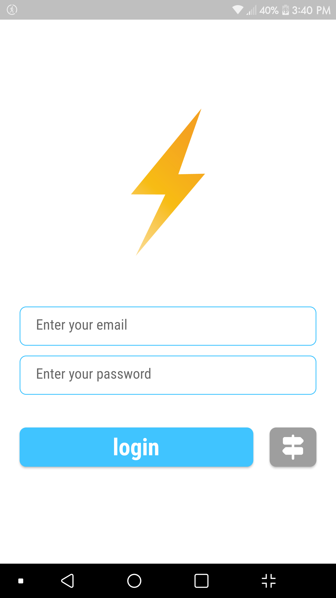

## This is a **Chat App** made with Flutter

- Beautiful colors and widgets
- It uses firebase cloud storage and firebase email authentication
- It works with streams to deliver a spontaneous and seamless experience
- flash and hero animation with the logo
- loading state and error handling (firebase authentication errors)

 

## Libraries and Packages used:
1- <a href="https://pub.dev/packages/firbase_core">firebase_core: 2.1.1</a>

2- <a href="https://pub.dev/packages/firebase_auth">firebase_auth: 4.1.0</a>

3- <a href="https://pub.dev/packages/cloud_firestore">cloud_firestore: 4.0.3</a>

4- <a href="https://pub.dev/packages/modal_progress_hud_nsn">modal_progress_hud_nsn: 0.3.0</a>

 

## App Screenshots

| Login Page |Register Page | Chat Page |
| :-: | :-: | :-: |
||||

 

---
`Finished on 27-Oct-22`